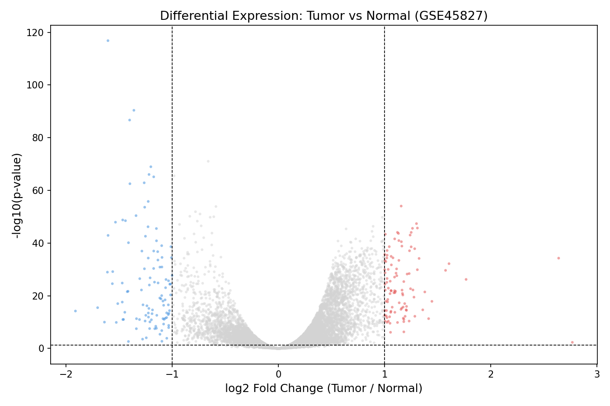

# genomics-expression-analysis
Differential gene expression analysis of breast cancer using Python
## Differential Gene Expression Analysis — GSE45827

Analyzed breast cancer microarray data from NCBI GEO (GSE45827) comparing 
tumor vs normal tissue across 155 samples.

**Methods:** Log2 normalization, Welch's t-test, Benjamini-Hochberg FDR correction  
**Result:** Identified 206 significantly dysregulated genes (FDR < 0.05, |log2FC| > 1)  
**Tools:** Python, pandas, scipy, matplotlib, seaborn  
**Data:** [GSE45827 on NCBI GEO](https://www.ncbi.nlm.nih.gov/geo/query/acc.cgi?acc=GSE45827)

